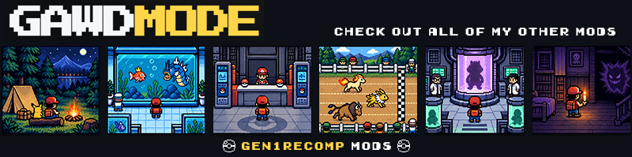

  

# Dungeon Delvers

A Pokémon Crystal mod for gen1recomp. Explore the cave network beneath the former Pewter Museum, excavate fossils, and bring Ancient Pokémon back to life.

## Install

1. Use gen1recomp **0.3.8 or newer** and a legally obtained Pokémon Crystal (USA/Europe Rev 1) ROM.
2. Place the Dungeon Delvers release ZIP in the launcher’s mods folder, or install it through the launcher. Select the mod for Pokémon Crystal and start the game.
3. Enter the former museum in Pewter City and talk to the Delve Desk attendant. Existing development saves keep their Dungeon Delvers records; the internal mod ID remains `pewter_dungeon_dev` for that reason.

Future releases are associated with [GawdMode/Dungeon-Delvers](https://github.com/GawdMode/Dungeon-Delvers) in the mod manifest so the launcher can offer updates when releases are published there.

## The delve

Pay the entry fee, draft one rental partner, and descend through generated cave floors. Battle roaming Pokémon and rival Delvers, manage your limited supplies, dodge traps, mine for treasure, and reach the next stairway. You can recruit Pokémon along the way. Safe rooms provide recovery, trading, and checkpoints; extracting secures your finds. Deeper strata, guardian fights, museum exhibits, Ancient revival, and Research Point rewards extend the run.

The six rental offers are normally held for 24 hours of in-game RTC time. **Losing a delve retires the roster immediately**, even within that period; the next offer starts a fresh 24-hour window. Resuming a saved checkpoint keeps that expedition's party and seed.

With PokeSurvive's Pokémon and type randomization enabled, individual Delvers Pokémon receive their own type rolls for each expedition, independent of PokeSurvive's randomizer seed. They retain those types during the delve, including co-op Pokémon swaps. Without those PokeSurvive toggles, Delvers uses the current game species types.

## Online co-op

At the desk, choose **CO-OP DELVE**. One player hosts, shares the room code, and the other joins. Pick your partners and begin together. The run supports shared floor progress, partner interactions, item and Pokémon swaps, shared mining finds, checkpoints, and battle spectating. Both players should use the same game, engine version, and mod setup.

**Both players must keep game speed at normal (1×). Increasing game speed on either player's client risks multiplayer desynchronization.**

## Compatibility

- PokeSurvive 2.1.2: optional randomization and compatibility hooks.
- Battle Factory Remix 1.2.3: independent battle systems and rental state.
- Neo Nursery: its exclusive baby species are excluded from generic dungeon encounter and rental pools.
- Pokémon Expansion / National Dex: eligible species can enter the depth pools when installed.
- Unique Menu Icons and other content mods may be used, subject to their own version requirements.

## Credits

Created by **Jasocorp**, with coding assistance from **ChatGPT**.

Fossil Pokémon sprite artwork: **Rool, Smalls, Pik, Bencc, Nuuk, Scarlax, Sam the Salmon, and SoupPotato (SourApple / BlazingMagmar)** from [Pokémon Gold & Silver ’97: Reforged](https://www.pokecommunity.com/threads/pok%C3%A9mon-gold-and-silver-97-reforged-complete.437360/). Item icon artwork: **NESS** via [The Spriters Resource](https://www.spriters-resource.com/).

Pokémon and Pokémon Crystal belong to Nintendo, Game Freak, and The Pokémon Company. This is an unofficial fan mod; no ROM or game files are distributed here.
